# 프로젝트 명

---

> 시계토끼 (Meet Hare)
> (약속 잡기 서비스)
>
> 

# 프로젝트 목표

---

- 사용자들 각자의 출발지점에 따른 중간지점을 찾을 수 있다.
- 캘린더 연동을 통해서 모이는 인원들이 가능한 날짜를 쉽게 정할 수 있다.
- 약속 장소 주변의 맛집 및 카페 등을 추천 받을 수 있다.
- 약속 후 정산을 쉽게 할 수 있다.

## 기능구현

- Web

- DB

 

## 팀원 소개 및 담당 역할

- 한장민 (팀장) : 중간 지점 추천
- 이종민 (팀원) : 만남 장소 추천
- 박종호 (팀원) : Infra, 예약 및 정산
- 이지원 (팀원) : 만남 장소 추천
- 이채영 (팀원) : 중간 지점 추천
- 심경섭 (팀원) : 모임 생성 및 일정 관리

| 한장민 [@HAANJM](https://github.com/HAANJM) | 이종민 [@john0513](https://github.com/john0513) | 박종호 [@TProgrammer](https://github.com/TProgramer) |
| ------------------------------------------- | ----------------------------------------------- | ---------------------------------------------------- |

| 이지원 [@jw427](https://github.com/jw427) | 이채영 [@chaeyoung222](https://github.com/chaeyeong222) | 심경섭 [@shimsihim](https://github.com/shimsihim) |
| ----------------------------------------- | ------------------------------------------------------- | ------------------------------------------------- |

 

## 기술 스택

- Frontend : Next.js 13, TypeScript
- Backend : Java 11, Spring Boot 2.7.16, Spring Security, MySQL 8.0.34, JPA
- Infra :
  - [AWS] EKS, ALB, ACM
  - [Service Mesh] Istio
  - [Monitoring] Prometheus & Grafana
  - [Logging] Elastic Search, Logstash, Kibana
  - [CI/CD] Github Actions + ArgoCD

 

## DETAIL

### 0. Conventions

- **git commit message**

  > type: Subject 형태로 작성하기

  type

  - [feat]: A new feature
  - [fix]: A bug fix
  - [docs]: Changes to documentation
  - [style]: Formatting, missing semi colons, etc; no code change
  - [refactor]: Refactoring production code
  - [test]: Adding tests, refactoring test; no production code change
  - [chore]: Updating build tasks, package manager configs, etc; no production code change

  Subject

  - 50자를 넘기지 말 것
  - 대문자로 시작하며 마침표는 적지 않을 것
  - 명령조로 말할것. 예를들면 changed, changes 가 아닌 change
  - 메인 커밋 메세지에 []를 통해서 표시해주기

- **GitLab branch 전략**

  - master : 제품으로 출시될 수 있는 브렌치. 최선의 상태 유지
  - study : 프로젝트 기간동안 공부한 내용을 각자 정리하는 브렌치
  - dev : 개발과정에서 fe/be/iot의 코드를 모아 빌드하여 테스트 하는 브렌치
  - (fe, be)/feature/기능명 : 해당 기능 구현을 진행할 때 사용하는 브렌치
  - hotfix : master의 문제를 해결하기 위한 브렌치

- **Jira**

  - 이슈생성
  - 월요일에 주 단위 스프린트 이슈들을 생성
  - 일주일에 40시간 이슈 생성 및 처리
  - 이슈 완료
  - 하나의 티켓은 되도록 하나의 커밋으로 처리

- **Style Guide**

  FE

  - var대신 const, let 사용하기
  - 변수명 : file_scope 상수는 UPPER_SNAKE_CASE, 그 외엔 camelCase. Boolean변수는 앞에 is 붙이기.
  - 클래스(생성자)명 : 파스칼 케이스를 이용한다. PascalCase
  - 클래스(HTML)명 : 케밥 케이스를 이용한다. kebal-case

  BE

  - 변수명, 인스턴스명: camelCase
  - 상수 변수명(static final): 대문자, 띄어쓰기는 \_ 사용
  - 클래스명, 생성자명: PascalCase
  - 함수명: camelCase(동사 + 명사로 구성)
  - Mysql table, column name: snake_case

### 1. Planning & Design

- 아이디어 정리

https://four-columnist-4da.notion.site/a8dfe06306b0458db395f598a156bcac?pvs=4

- 와이어 프레임

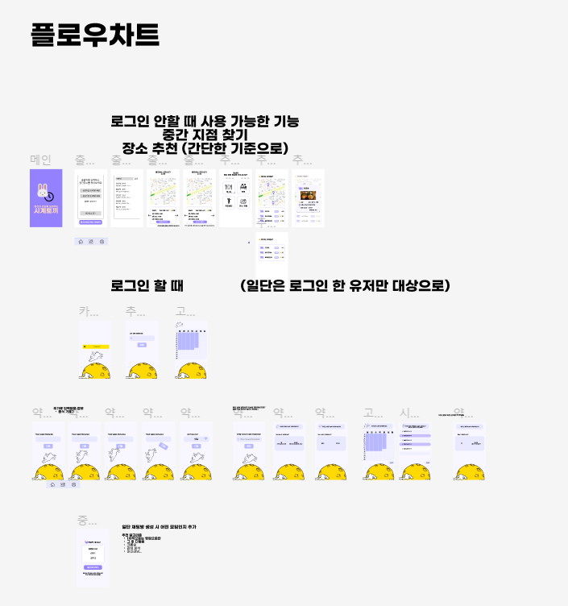

- ERDCloud

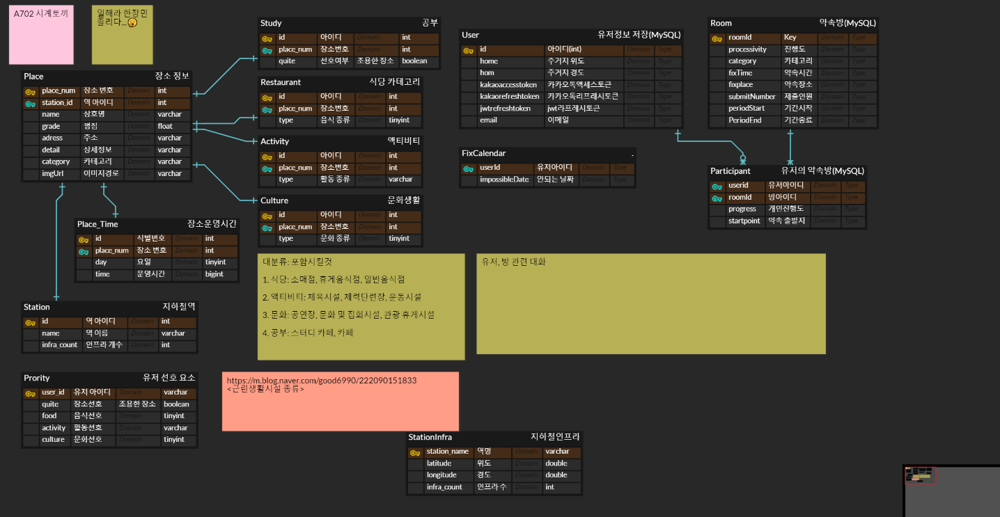

- API 명세서

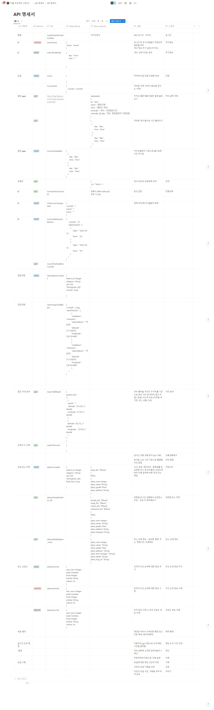

- 아키텍처

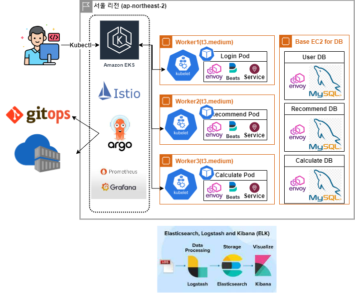

 

### 2. Development & Test

- Jira를 통한 일정관리

  - 매 주 월요일에 주 단위 이슈를 생성하고 금요일까지 40의 Story Point를 완료함으로써 일정을 관리했습니다

  1. 1주 차 스프린트

  2. 2주 차 스프린트

  3. 3주 차 스프린트

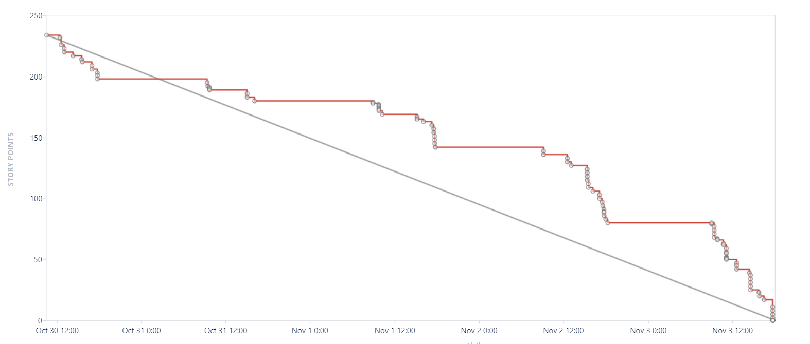

  4. 4주 차 스프린트

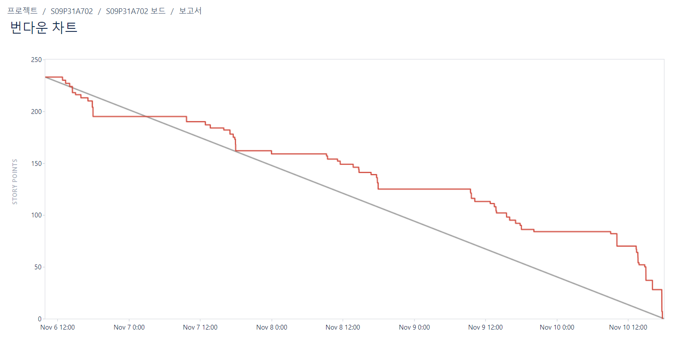

  5. 5주 차 스프린트
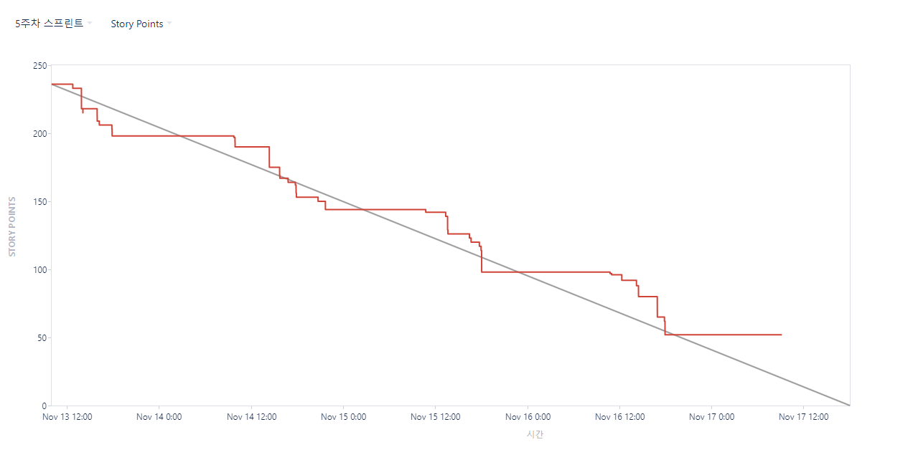

### 3. Operation

- Web

### 메인 화면

| 메인 화면                                                                     | 메인 화면                                                                     |
| ----------------------------------------------------------------------------- | ----------------------------------------------------------------------------- |
| 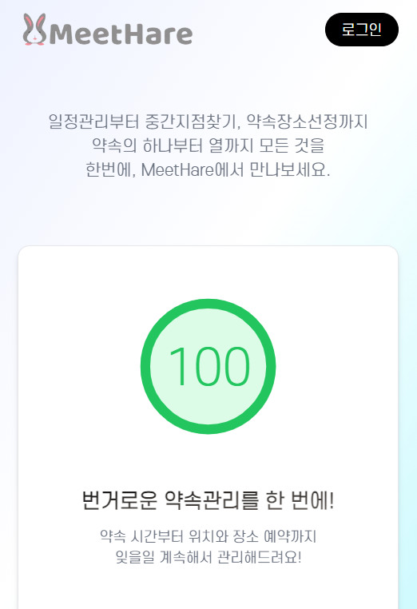| 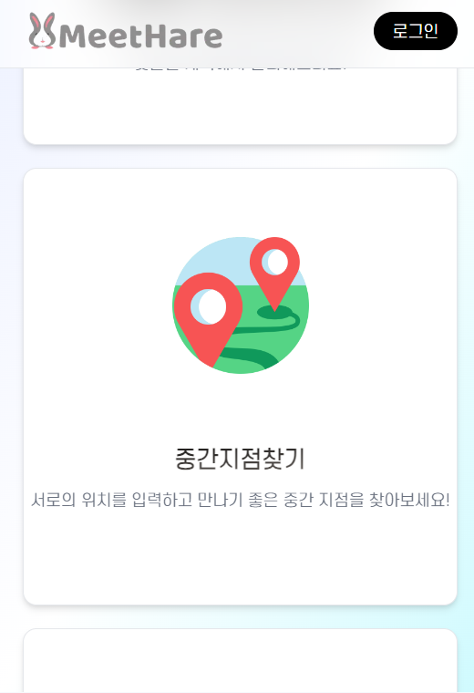 |

 

### 중간 지점 추천

| 출발지 입력                                                                   | 중간 지점 찾기                                                                |
| ----------------------------------------------------------------------------- | ----------------------------------------------------------------------------- |
| 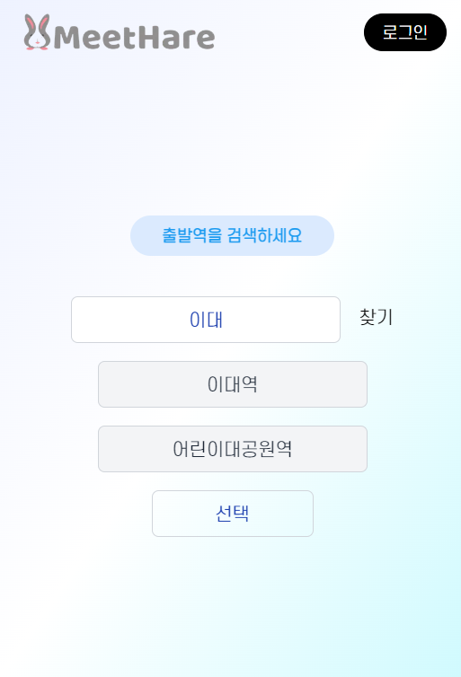| 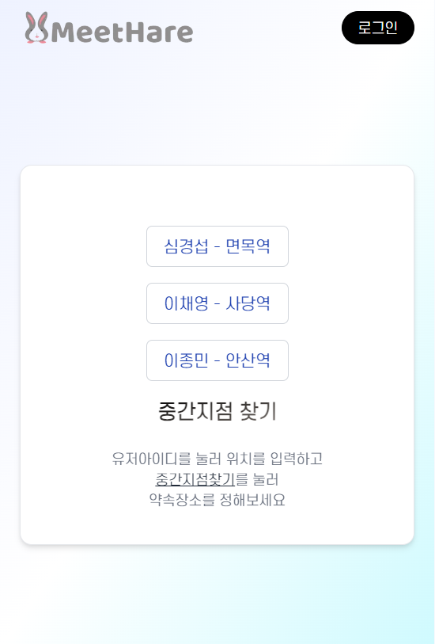 |

- 사용자 검색어가 포함된 역 정보 조회
- 도출된 역 리스트 중 원하는 역을 클릭 후 선택을 누르면 해당 역을 출발지로 지정

| 중간 지점 찾기                                                                | 중간 지점 추천                                                                |
| ----------------------------------------------------------------------------- | ----------------------------------------------------------------------------- |
| 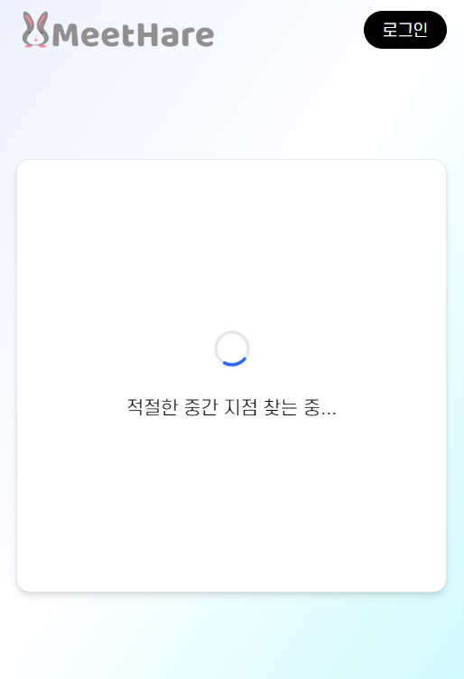| 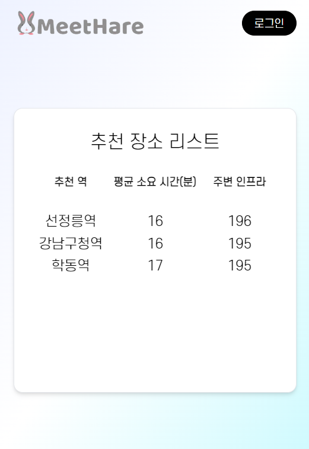 |

- 유저별 출발지를 기준으로 무게중심을 활용한 중간지점을 도출
- 도출된 중간지점 위치를 기반으로 주변 지하철역 목록 불러오기
- 목록 출력 시 예상되는 이동평균 시간과 주변 인프라 수를 함께 출력

### 중간 지점에 따른 이동 경로 추천

| 전체 이동 경로 찾기                                                           |
| ----------------------------------------------------------------------------- |
|  |

| 출발지 별 이동 경로                                                           | 출발지 별 이동 경로                                                           |
| ----------------------------------------------------------------------------- | ----------------------------------------------------------------------------- |
| 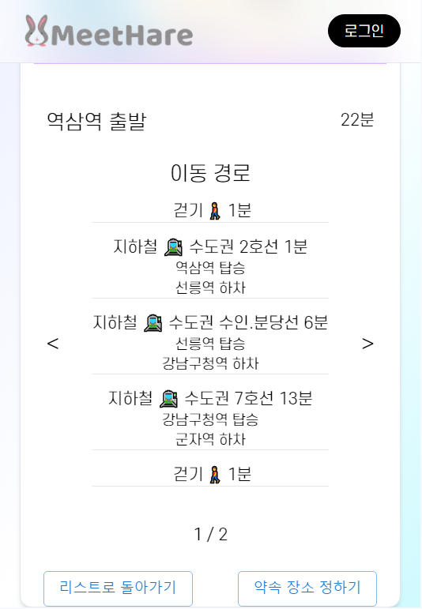 | 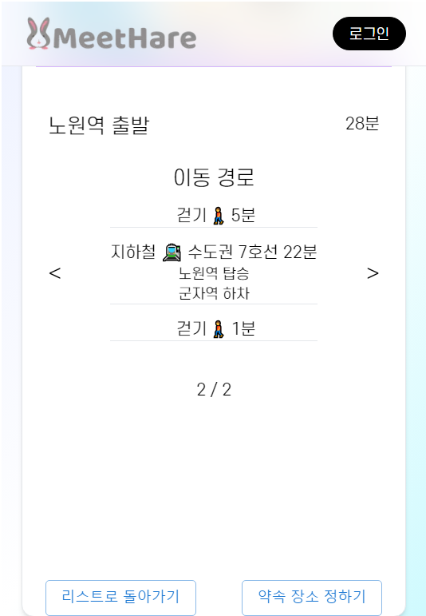 |

- 정해진 중간 지점까지의 이동 경로를 지도로 표시
- 각 출발지부터의 이동 방법과 최소 이동 시간을 표시
- 경로가 마음에 들지 않을 시 다시 중간 지점을 선택하는 페이지로 이동 가능
- 중간 장소로 확정하고 약속 장소(식당, 카페 등) 추천 페이지로 이동

### 로그인을 통한 약속 생성 및 관리

| 약속 리스트 확인                                                                                                    | 약속 생성                                                                                                           | 약속 생성 및 일정 생성                                                                                              |
| ------------------------------------------------------------------------------------------------------------------- | ------------------------------------------------------------------------------------------------------------------- | ------------------------------------------------------------------------------------------------------------------- |
| 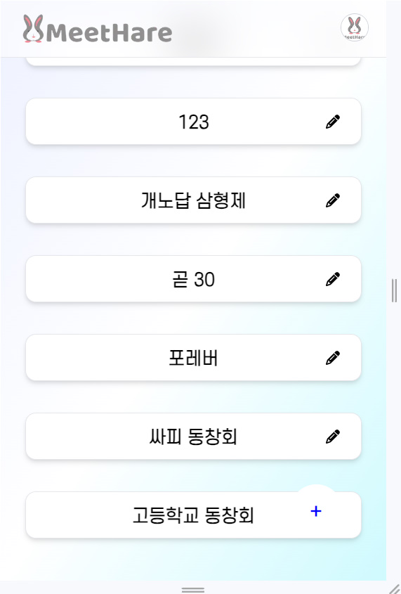 |  | 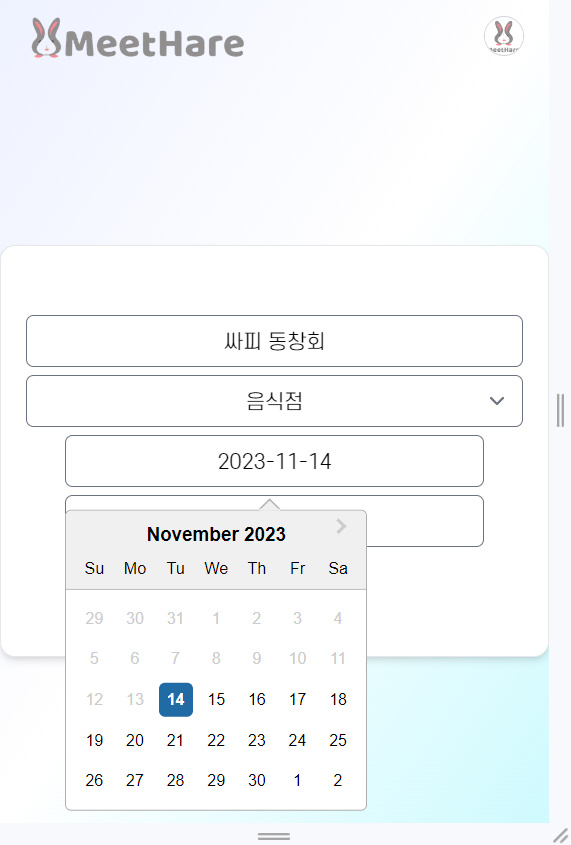 |

- 로그인을 통한 약속 생성 및 관리
- 약속 생성 버튼을 통해서 시작일과 종료일을 지정

| 본인의 일정 입력                                                                                                    | 제출자 확인                                                                                                         | 미제출자 확인                                                                                                       |
| ------------------------------------------------------------------------------------------------------------------- | ------------------------------------------------------------------------------------------------------------------- | ------------------------------------------------------------------------------------------------------------------- |
| 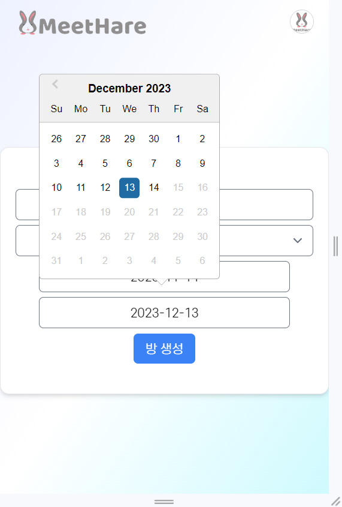 | 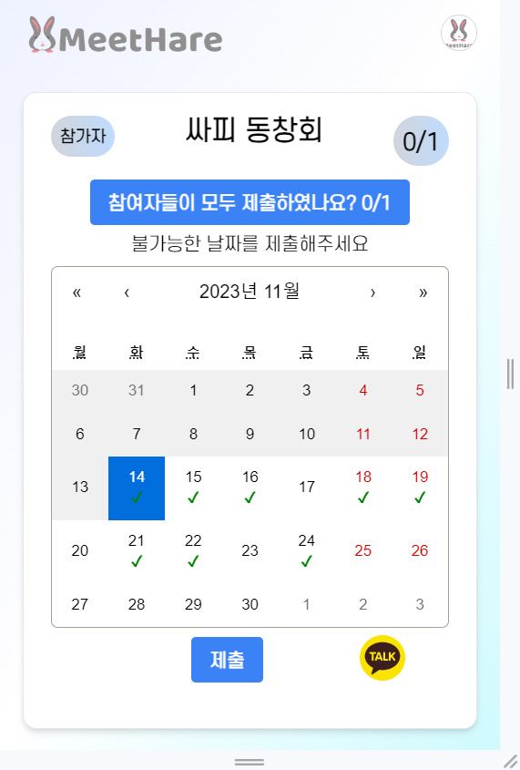 |  |

- 약속 생성 후 헛 화면에서 각자 가능, 불가능한 날짜를 입력
- 좌측 상단와 우측 상단에는 현재의 참가자와 제출, 미 제출한 인원 각각 확인

| 카카오톡 공유                                                                                                       | 카카오톡 공유 선택                                                                                                  | 카카오톡 메시지 공유                                                                                                |
| ------------------------------------------------------------------------------------------------------------------- | ------------------------------------------------------------------------------------------------------------------- | ------------------------------------------------------------------------------------------------------------------- |
|  |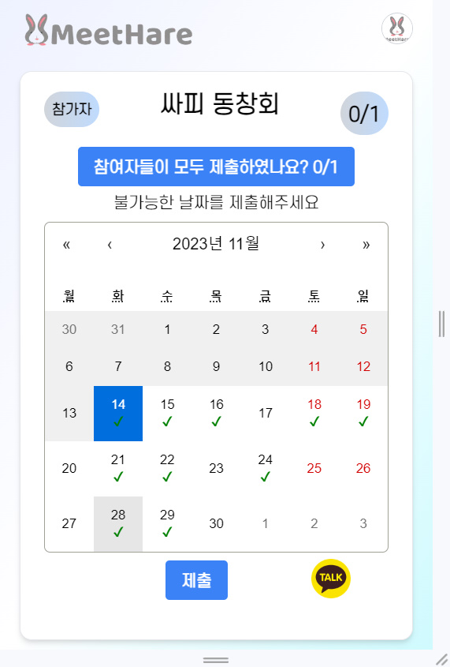 | 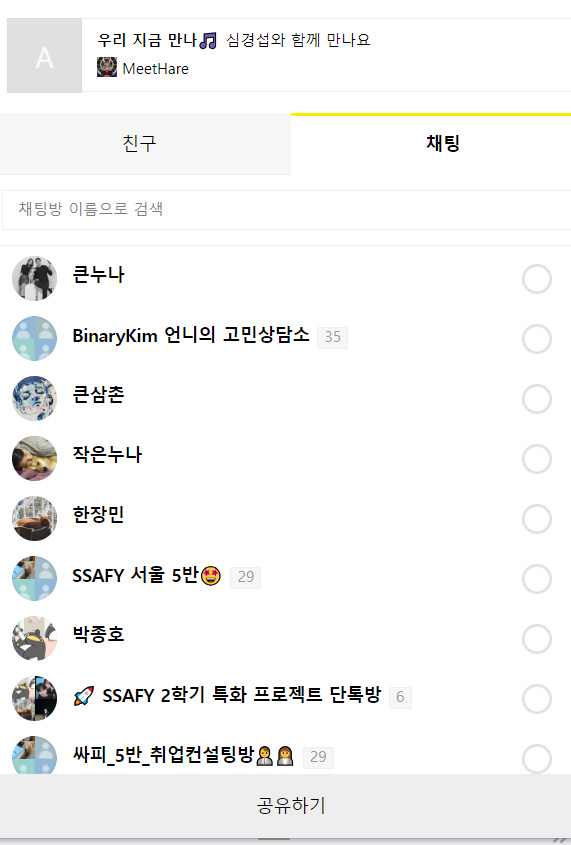 |

- 우측 하단의 카카오톡 공유하기를 통해서 약속 방 공유
- 신규 사용자는 링크를 통해서 모임 입장
- 비 로그인 상태시 쿠키를 통해서 현재의 페이지를 저장하고 로그인 시 바로 해당 방으로 이동

| 신규 사용자 입장                                                                                                    | 약속 일정 추천                                                                                                      | 선호장소 입력                                                                                                       |
| ------------------------------------------------------------------------------------------------------------------- | ------------------------------------------------------------------------------------------------------------------- | ------------------------------------------------------------------------------------------------------------------- |
| 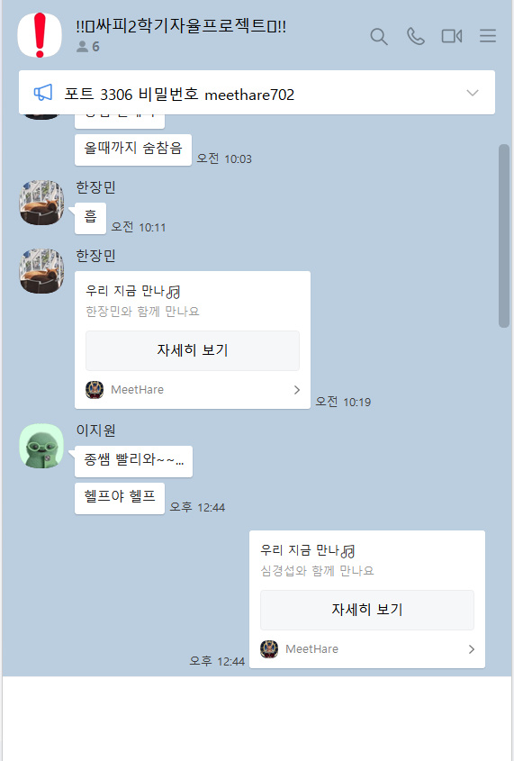|  | 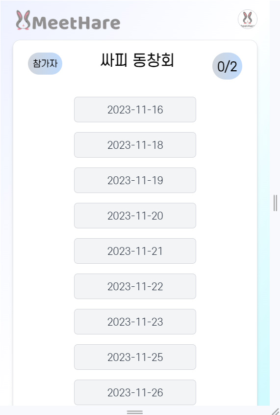 |

- 신규 사용자가 들어올 경우 참가자가 늘어난 것을 확인
- 다음 단계로 넘어갈 시 참가자들의 가능 날짜를 비교하여 약속 일정을 추천

### 중간 지점에 따른 약속 장소 카테고리 별 추천

| 추천 장소 데이터 크롤링                                               | 추천 장소 데이터 크롤링                                               |
| --------------------------------------------------------------------- | --------------------------------------------------------------------- |
| 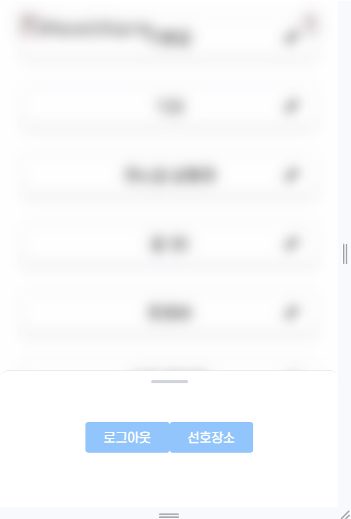 | |

- SpringBoot에서 웹 테스트 자동화 프레임워크인 Selenium을 이용하여 크롤링
- 네이버 지도 웹사이트에서 약 800여개 역의 카테고리별(식당, 운동시설, 스터디카페, 문화시설) 장소들 정보를 수집

| 카테고리 별 장소 추천(비로그인)                                               | 카테고리 별 장소 추천(로그인)                                       |
| ----------------------------------------------------------------------------- | ------------------------------------------------------------------- |
|  |

- 만날 역을 결정하면 해당 역 근처의 만남 장소들을 추천
- 로그인하지 않았을 경우 각 카테고리별로 추천 장소들을 제공
- 로그인했을 경우 약속방 생성시 선택했던 카테고리에 해당하는 추천 장소들을 제공

| 추천 장소 상세 정보 제공                                                  | 추천 장소 상세 정보 제공                                                          |
| ------------------------------------------------------------------------- | --------------------------------------------------------------------------------- |
| 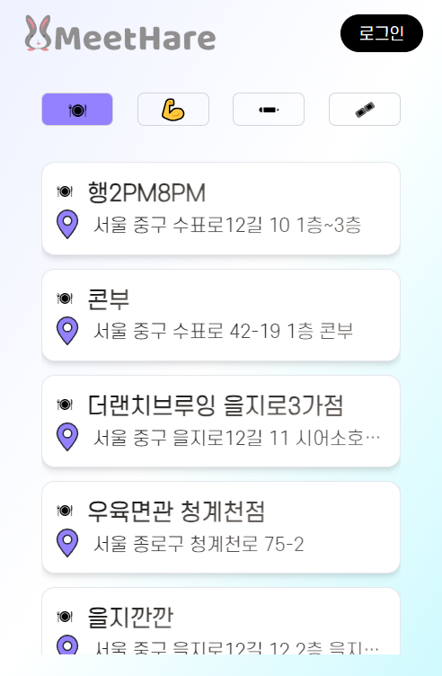 | 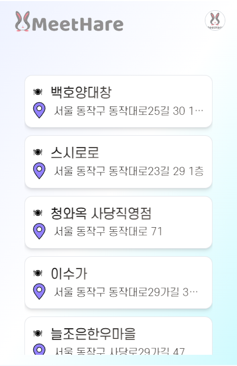|

- 장소 카드를 클릭하면 해당 장소의 상호명, 사진, 주소, 별점, 운영 시간, 설명 제공
- 사용자의 편의성을 위해 해당 장소의 주소를 복사할 수 있는 복사 버튼 제공

### 4. ETC
